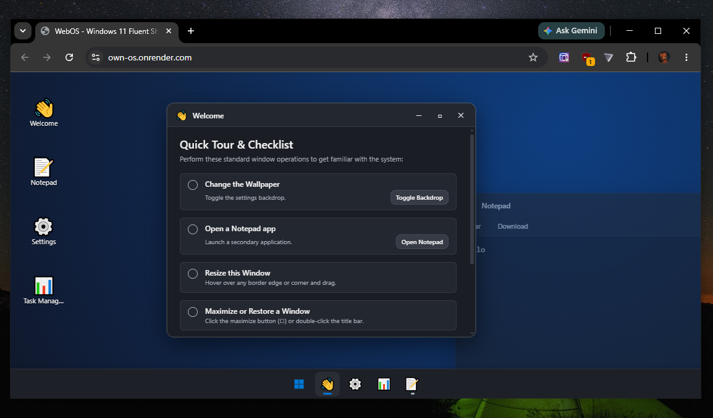

# WebOS - Own OS

A browser-based desktop experience with persistent memory and customizable themes.

## Screenshot

## Try It Out

https://own-os.onrender.com/

Open the project in your browser and start using it like a mini operating system. Everything is automatically remembered, so you can leave and come back later without losing your workspace.

## Features

### Window Management
- Move windows
- Drag and reposition freely
- Resize windows
- Minimize windows
- Maximize windows

### Persistent Memory
- Automatically saves your workspace
- Open windows are restored exactly as you left them
- Settings and preferences are remembered
- Data remains even after refreshing or closing the page

### Applications
- Welcome app
- Notepad with automatic saving
- Taskbar for managing open apps

### Personalization
- Wallpapers
- Themes
- Accent colors
- Settings customization
